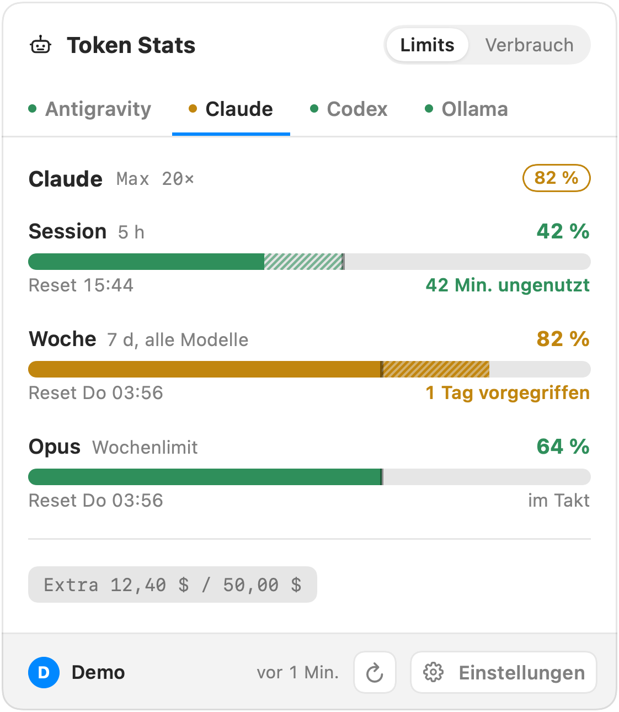
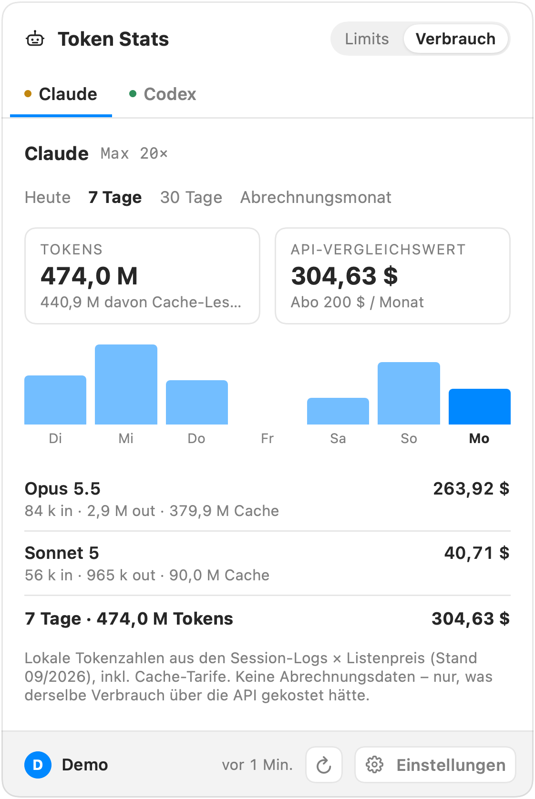
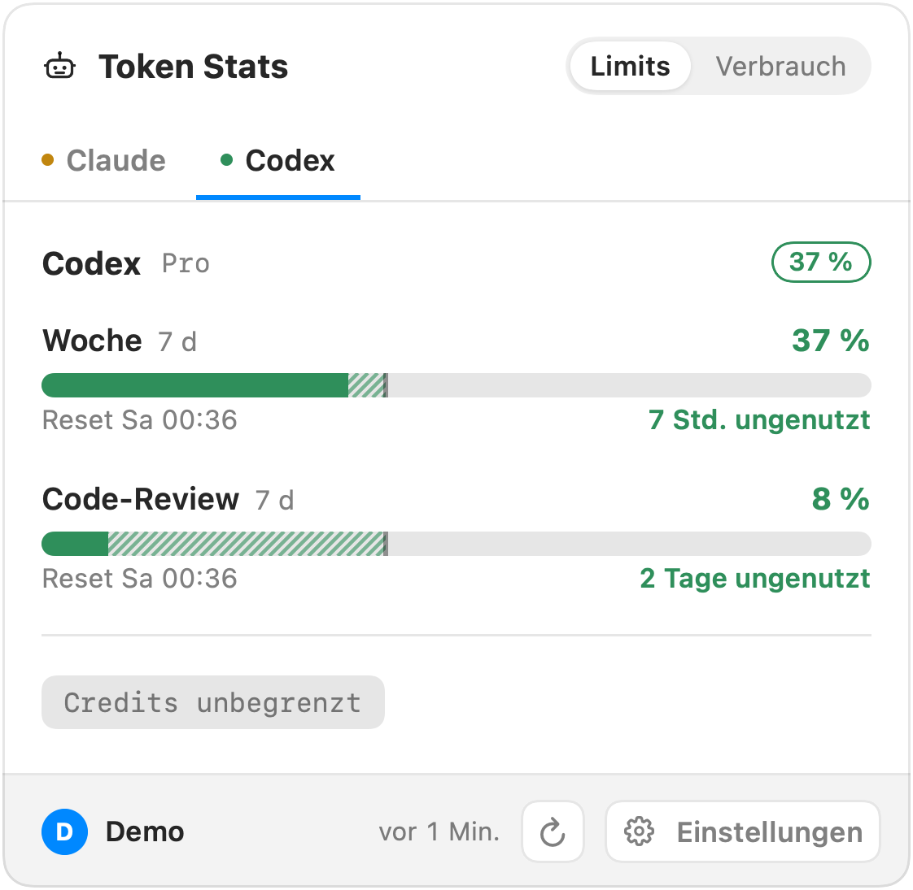
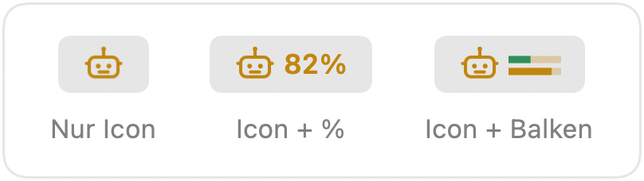
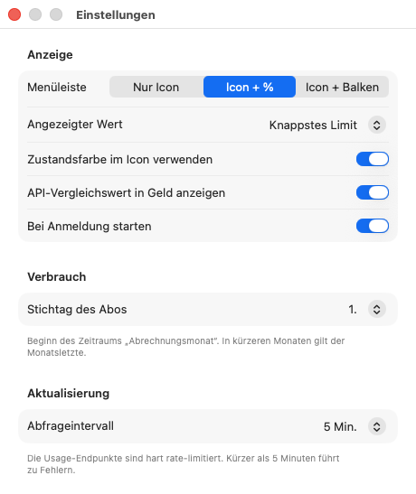

# Token Stats

[](#voraussetzungen)
[](https://www.swift.org)
[](https://developer.apple.com/xcode/swiftui/)
[](https://github.com/mahype/token-stats/releases/latest)
[](https://github.com/mahype/token-stats/releases)
[](#roadmap)
[](#anbieter)
[](#was-die-app-liest-speichert-und-kontaktiert)
[](#was-die-app-liest-speichert-und-kontaktiert)
[](#voraussetzungen)
[](LICENSE)

Menüleisten-App für macOS, die die Kontingente deiner KI-Coding-Abos anzeigt:
Session-Fenster, Wochenlimit, Modell-Limits und Extra-Verbrauch von Claude Code und
Codex. Dazu eine Verbrauchsseite mit Tokenzahlen je Tag und Modell und dem
**API-Vergleichswert** – was derselbe Verbrauch über die API gekostet hätte.

Die App beantwortet ohne Browser und ohne CLI die Frage **„Darf ich noch?“**. Sie nutzt
die Anmeldungen, die Claude Code und Codex ohnehin auf deinem Mac haben. Kein Konto,
keine Cloud, keine Telemetrie.

<p align="center">
  <picture>
    <source media="(prefers-color-scheme: dark)" srcset="screenshots/limits-dark.png">
    
  </picture>
</p>

## Funktionen

- **Menüleisten-Symbol** in der Zustandsfarbe des knappsten Limits – grün, ab 80 % gelb,
  ab 100 % rot. Wahlweise nur das Symbol, mit Prozentwert oder mit zwei Mini-Balken
  für Session und Woche.
- **Ein Tab je Anbieter**, nach Dringlichkeit sortiert: Der knappste Anbieter steht
  links und ist beim Öffnen aktiv. Der Statuspunkt am Tab zeigt den Zustand ohne Klick.
- **Meter je Limit** mit Reset-Zeit und **Pace-Marke**: Die senkrechte Marke steht dort,
  wo du bei gleichmäßigem Verbrauch wärst. Der Abstand dazu ist schraffiert und darunter
  in Zeit umgerechnet, z. B. `1 Tag vorgegriffen` oder `4 Tage ungenutzt`.
- **Verbrauch** für Heute, 7 Tage, 30 Tage oder den Abrechnungsmonat: Tokens mit
  getrennt ausgewiesenem Cache-Anteil, Tagesdiagramm und Aufschlüsselung je Modell.
- **API-Vergleichswert** aus Tokenzahl × Listenpreis, mit mitgelieferter Preistabelle.
  Abschaltbar, wenn du nur Tokens sehen willst.
- **Schont die Rate-Limits:** höchstens alle 5 Minuten eine Abfrage, der letzte Stand
  überlebt Neustarts. Bei HTTP 429 bleiben die letzten Werte mit Pause-Symbol stehen –
  nie eine leere Anzeige.
- Rechtsklick aufs Symbol: Aktualisieren, Anzeige-Modus, Bei Anmeldung starten,
  Einstellungen (auch mit `⌘,` bei offenem Popover).

<table>
  <tr>
    <th width="50%">Verbrauch mit API-Vergleichswert</th>
    <th width="50%">Codex</th>
  </tr>
  <tr>
    <td valign="top">
      <picture>
        <source media="(prefers-color-scheme: dark)" srcset="screenshots/usage-dark.png">
        
      </picture>
    </td>
    <td valign="top">
      <picture>
        <source media="(prefers-color-scheme: dark)" srcset="screenshots/limits-codex-dark.png">
        
      </picture>
    </td>
  </tr>
</table>

Die drei Anzeige-Modi der Menüleiste:

<p align="center">
  <picture>
    <source media="(prefers-color-scheme: dark)" srcset="screenshots/menubar-dark.png">
    
  </picture>
</p>

Die Einstellungen – Anzeige, Stichtag des Abos und Abfrageintervall:

<p align="center">
  <picture>
    <source media="(prefers-color-scheme: dark)" srcset="screenshots/settings-dark.png">
    
  </picture>
</p>

<sub>Alle Werte in den Screenshots sind Demo-Werte.</sub>

## Anbieter

| Anbieter | Limits | Verbrauch | Stand |
|---|---|---|---|
| **Claude Code** | Session 5 h · Woche · Modell-Limits (Opus, Sonnet …) · Extra-Verbrauch | ✅ | v1 / v2 |
| **Codex** | Session 5 h · Woche · Code-Review · Credits | ✅ | v1 / v2 |
| Gemini CLI / Antigravity, GitHub Copilot, Cursor | – | – | geplant (v3) |
| Prepaid (OpenRouter, DeepSeek, Moonshot, Fireworks) | echtes Restguthaben | – | geplant (v3) |

Jeder Anbieter ist eine Datei, die das Protokoll `UsageProvider` erfüllt – die
Oberfläche bleibt beim Hinzufügen unberührt.

## Voraussetzungen

- macOS 14 (Sonoma) oder neuer, Apple Silicon oder Intel
- Claude Code und/oder Codex, mindestens einmal angemeldet

Keine Pakete, kein Framework, keine Laufzeit – ein einzelnes `.app`.

## Installation

**[⬇ Token Stats herunterladen](https://github.com/mahype/token-stats/releases/latest)** –
unter *Assets* die Datei `Token-Stats-<Version>.dmg`.

1. Das DMG öffnen und **Token Stats** auf **Programme** ziehen.
2. Token Stats aus dem Programme-Ordner starten. Das Robotersymbol erscheint in der
   Menüleiste; ein Dock-Symbol gibt es nicht.
3. Optional: Rechtsklick aufs Symbol → **Bei Anmeldung starten**.

Updates kommen ab Version 0.2.0 von selbst: Token Stats sucht einmal täglich und
installiert eine neue Version beim Beenden. Wer 0.1.x hat, lädt 0.2.0 einmal von Hand.

Die App ist mit Developer ID signiert und von Apple notarisiert. Beim ersten Start liest
sie alle Session-Logs einmal ein (bei einigen Gigabyte Logs etwa 40 Sekunden), danach
nur noch, was neu dazukommt.

### Aus dem Quelltext bauen

Mit Xcode 16 oder neuer (Swift 6) und [XcodeGen](https://github.com/yonaskolb/XcodeGen):

```bash
brew install xcodegen
git clone https://github.com/mahype/token-stats.git
cd token-stats
make run
```

`make run` baut die App und startet sie. Das Makefile nutzt `/Applications/Xcode.app`,
auch wenn `xcode-select` auf die Command Line Tools zeigt.

### Windows

Eine Portierung als Tray-App für Windows 10/11 (nativ ARM64, auch x64) liegt in
[`windows/`](windows/README.md) – gleiche Datenquellen und Rechnung, gebaut mit .NET 10.

## Entfernen

**Bei Anmeldung starten** ausschalten, die App beenden, dann:

```bash
rm -rf "/Applications/Token Stats.app"
rm -rf ~/Library/Application\ Support/TokenStats   # letzter Stand und Verbrauchs-Aggregat
defaults delete de.mahype.TokenStats              # Einstellungen
```

Deine Anmeldungen bei Claude Code und Codex bleiben unberührt.

## Was die App liest, speichert und kontaktiert

| Was | Wo |
|---|---|
| Claude-Zugangsdaten (nur lesen) | Schlüsselbund `Claude Code-credentials`, Fallback `~/.claude/.credentials.json` |
| Codex-Zugangsdaten (nur lesen) | `~/.codex/auth.json` |
| Tokenzahlen (nur lesen) | `~/.claude/projects/**/*.jsonl`, Session-Logs unter `~/.codex/` |
| Letzter Stand der Limits | `~/Library/Application Support/TokenStats/state.json` (nur Prozente und Reset-Zeiten) |
| Verbrauchs-Aggregat je Tag und Modell | `~/Library/Application Support/TokenStats/usage.sqlite` |
| Einstellungen | UserDefaults `de.mahype.TokenStats` |
| Claude-Kontingent | `api.anthropic.com/api/oauth/usage` |
| Codex-Kontingent | `chatgpt.com/backend-api/wham/usage` |
| Update-Prüfung (täglich, abschaltbar) | `mahype.github.io/token-stats/appcast.xml`, Download von `github.com` |

- **Zugangsdaten werden nur gelesen** – nicht kopiert, nicht ins App-Verzeichnis
  gespiegelt, nicht erneuert. Ist ein Token abgelaufen, zeigt die App einen Hinweis;
  einmal Claude Code bzw. Codex starten genügt, die CLI erneuert es selbst.
- **Nur die Anbieter-Endpunkte** werden kontaktiert, dazu einmal täglich der Update-Feed –
  ohne Systemdaten, abschaltbar unter Einstellungen → Updates. Preise stammen aus der
  mitgelieferten Tabelle, nicht aus dem Netz.
- **Abfrageintervall mindestens 300 s.** Die Usage-Endpunkte sind undokumentiert und
  hart rate-limitiert.

## API-Vergleichswert ≠ Kosten

Abo-Verbrauch wird nicht pro Nachricht abgerechnet, und die Usage-Endpunkte liefern
nur Prozentwerte. Der Betrag auf der Verbrauchsseite ist deshalb eine Modellrechnung:
Input, Output, Cache-Schreiben und Cache-Lesen aus den lokalen Logs, jeweils mal
Listenpreis zum Zeitpunkt der Anfrage. Er zeigt, was derselbe Verbrauch über die API
gekostet hätte – nicht, was du zahlst.

Cache-Tokens stehen immer getrennt: Bei Claude Code machen sie oft rund 80 % des
Volumens aus, kosten aber nur einen Bruchteil des Input-Preises. Eine nackte
Gesamt-Tokenzahl würde in die Irre führen.

## Entwicklung

| Befehl | Zweck |
|---|---|
| `make build` | Projekt aus `project.yml` erzeugen und bauen |
| `make run` | bauen, laufende Instanz beenden, neu starten |
| `make test` | Unit-Tests (beendet eine laufende Instanz, danach `make run`) |
| `make release` | Universal-Build als DMG nach `build/`: signiert, notarisiert, gestapelt |
| `make publish` | Tag, GitHub-Release und Eintrag im Update-Feed für dieses DMG |
| `make screenshots` | die Bilder dieser README nach `screenshots/` rendern (außer Einstellungen, siehe [CLAUDE.md](CLAUDE.md)) |
| `Scripts/update-pricing.sh` | Preistabelle aus LiteLLM aktualisieren |

`TokenStats.xcodeproj` ist nicht eingecheckt, XcodeGen erzeugt es bei jedem Build.
`usage.sqlite` löschen erzwingt ein komplettes Neueinlesen der Logs.

| Pfad | Inhalt |
|---|---|
| `Sources/TokenStats/Providers/` | ein Anbieter je Datei: Zugangsdaten lesen, Endpunkt abfragen, Antwort übersetzen |
| `Sources/TokenStats/Model/` | Stand je Anbieter, Abruftakt, Rate-Limit-Behandlung, Einstellungen |
| `Sources/TokenStats/Usage/` | Log-Parser, SQLite-Aggregat, Preistabelle |
| `Sources/TokenStats/UI/` | Popover, Verbrauchsseite, Einstellungen, Menüleisten-Symbol |
| `Tests/TokenStatsTests/` | Parser- und Verbrauchstests |

Das vollständige Design mit den Begründungen hinter den Entscheidungen steht in
[SPEC.md](SPEC.md).

## Roadmap

- [x] **v1** – Limits für Claude und Codex, drei Anzeige-Modi, Rate-Limit-Behandlung
- [ ] **v2** – Verbrauchsseite mit API-Vergleichswert ✅ · Mitteilungen bei 50/80/90 %
  und bei Reset
- [ ] **v3** – Gemini, Antigravity, Copilot, Cursor, Prepaid-Guthaben,
  Claude-Account-Wechsel

## Lizenz

MIT – siehe [LICENSE](LICENSE).

## Hinweis

Unabhängiges Community-Projekt, nicht verbunden mit Anthropic oder OpenAI.
Claude ist eine Marke von Anthropic, Codex und ChatGPT sind Marken von OpenAI.
Die abgefragten Usage-Endpunkte sind nicht dokumentiert und können sich jederzeit
ändern.
