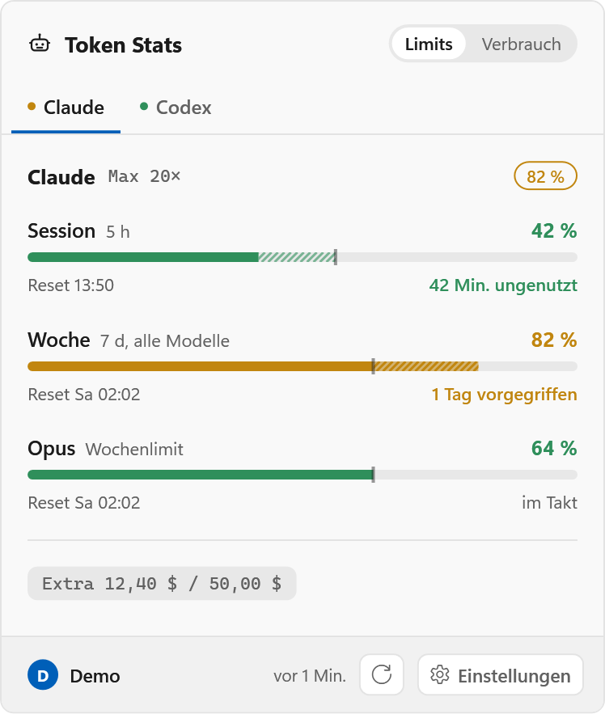
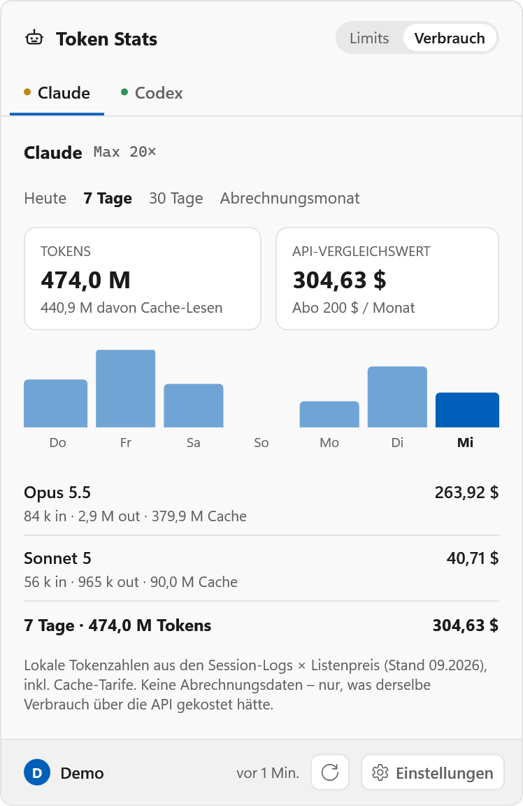

# Token Stats für Windows

Dieselbe App wie auf macOS, als Tray-App für Windows 10/11 – nativ für **ARM64**
(Snapdragon), ebenso für x64 baubar. Gleiche Datenquellen, gleiche Rechnung, gleiche
Texte; die Spezifikation in [SPEC.md](../SPEC.md) gilt unverändert, mit den
Abweichungen unten.

<p align="center">
  <picture>
    <source media="(prefers-color-scheme: dark)" srcset="screenshots/limits-dark.png">
    
  </picture>
  <picture>
    <source media="(prefers-color-scheme: dark)" srcset="screenshots/usage-dark.png">
    
  </picture>
</p>

## Bauen und starten

Voraussetzung: [.NET 10 SDK](https://dotnet.microsoft.com/download) (ARM64-Installer auf
ARM-Geräten).

```powershell
cd windows
dotnet test                      # Unit-Tests
dotnet run --project TokenStats  # Debug-Build starten
.\publish.ps1                    # eine EXE nach build\windows\win-arm64, ohne installiertes .NET
.\publish.ps1 -Runtime win-x64   # dasselbe für Intel/AMD
```

Die veröffentlichte `TokenStats.exe` braucht keine Installation. Windows 11 legt neue
Tray-Symbole zunächst in den Überlaufbereich (`^`); per Drag & Drop in die Taskleiste
ziehen oder unter _Einstellungen → Personalisierung → Taskleiste → Andere
Taskleistensymbole_ einschalten.

README-Bilder neu rendern (nur Debug-Build, Demo-Werte, hell und dunkel; schreibt auch
das App-Symbol `TokenStats.ico`, das danach nach `TokenStats\` gehört):

```powershell
$env:TOKENSTATS_SCREENSHOTS = "$PWD\screenshots"; dotnet run --project TokenStats
```

## Was anders ist als auf macOS

| Thema             | macOS                                                  | Windows                                                                                                         |
| ----------------- | ------------------------------------------------------ | --------------------------------------------------------------------------------------------------------------- |
| Symbol            | Menüleiste, variable Breite                            | Infobereich, quadratisch 16 px: bei „Icon + %“ steht nur die Zahl, bei „Icon + Balken“ der Roboter über den Balken |
| Popup             | `NSPopover`                                            | rahmenloses Fenster über der Taskleiste, schließt bei Fokusverlust oder `Esc`                                     |
| Einstellungen     | `⌘,`                                                   | `Strg+,` bei offenem Popup, Rechtsklick, Zahnrad                                                                 |
| Claude-Zugang     | Schlüsselbund, Datei als Fallback                      | nur `%USERPROFILE%\.claude\.credentials.json` – Claude Code nutzt unter Windows keinen Credential Store          |
| Daten der App     | `~/Library/Application Support/TokenStats/`            | `%LOCALAPPDATA%\TokenStats\` (`settings.json`, `state.json`, `usage.sqlite`)                                    |
| Autostart         | `SMAppService`                                         | Wert `TokenStats` unter `HKCU\Software\Microsoft\Windows\CurrentVersion\Run`                                    |
| Updates           | Sparkle                                                | keine automatischen Updates                                                                                     |

Unverändert gelten die harten Regeln aus [CLAUDE.md](../CLAUDE.md): Abfrage höchstens
alle 300 s, Zugangsdaten nur lesen, „API-Vergleichswert“ statt „Kosten“, Cache immer
getrennt. Die Logs werden mit geteiltem Lesezugriff geöffnet, damit Claude Code und
Codex weiterschreiben können. Die Preistabelle ist
[`Sources/TokenStats/Resources/pricing.json`](../Sources/TokenStats/Resources/pricing.json)
und wird eingebettet – `Scripts/update-pricing.sh` aktualisiert beide Plattformen.

## Aufbau

Ein Ordner je Schicht, wie in `Sources/TokenStats/`:

| Pfad                   | Inhalt                                                                      |
| ---------------------- | --------------------------------------------------------------------------- |
| `TokenStats/Providers` | Claude und Codex: Zugangsdaten lesen, Endpunkt abfragen, Antwort übersetzen |
| `TokenStats/Model`     | Stand je Anbieter, Abruftakt, Rate-Limit-Behandlung, Einstellungen, Formate |
| `TokenStats/Usage`     | Log-Parser, SQLite-Aggregat, Preistabelle                                   |
| `TokenStats/UI`        | Tray-Symbol, Popup, Seite „Verbrauch“, Einstellungen                        |
| `TokenStats/App`       | Einstieg, Tray-Steuerung, Screenshots                                       |
| `TokenStats.Tests`     | die Swift-Tests aus `Tests/TokenStatsTests`, portiert, plus ein Ledger-Test |

WPF mit .NET 10; das Symbol im Infobereich und sein Kontextmenü kommen aus WinForms,
SQLite aus `Microsoft.Data.Sqlite`. Das Popup wird bei jeder Änderung komplett neu
aufgebaut – das hält den Code nah an den SwiftUI-Views.
